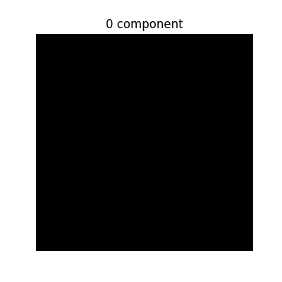
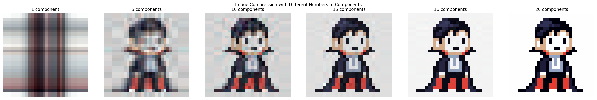

## SVD Image compression
'SVD Image compression.ipynb' demonstrates the process of image compression using Singular Value Decomposition (SVD). SVD is a powerful mathematical technique that can be used to reduce the dimensionality of data while preserving its essential features. In this notebook, we will apply SVD to binary image and color images and visualize the results.

## Requirements
- Python 3.x
- Jupyter Notebook
- NumPy
- Matplotlib
- imageio
- PIL (Pillow)

## Usage
1. Clone or download this repository.
2. Open the Jupyter Notebook file `SVD Image compression.ipynb`.
3. Run the cells sequentially to see the image compression process in action.
4. Modify the `max_components` parameter in the `compress_image` function to see how the number of components affects the quality of the compressed image.

## Example
The notebook includes an example of compressing an image named `vampire.png`. Ensure that this image is in the same directory as the notebook for it to load correctly.
